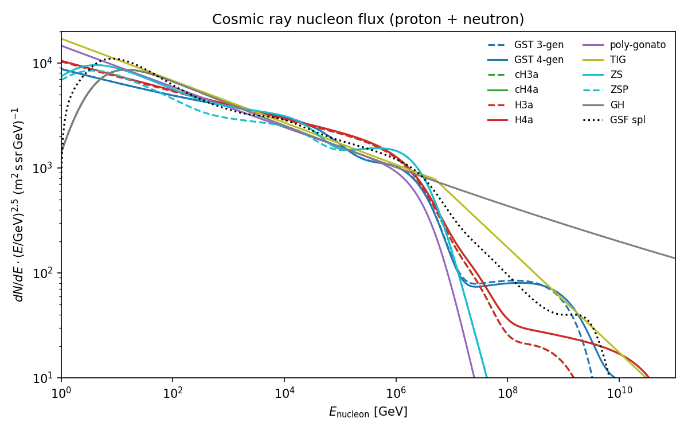
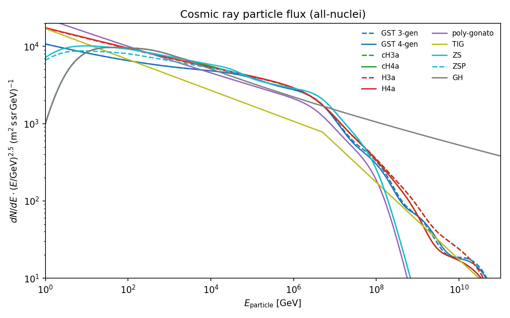
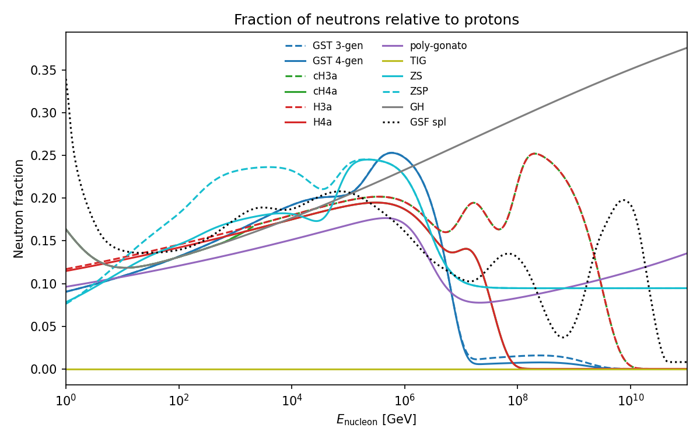
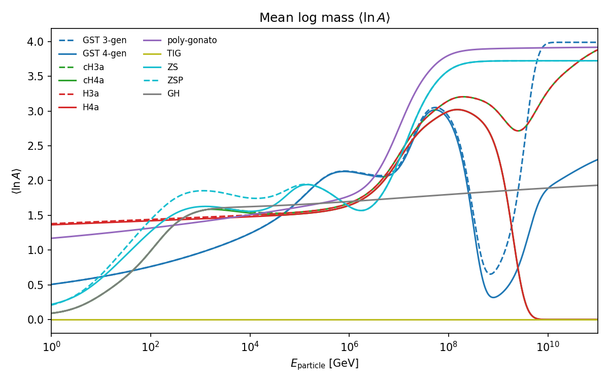
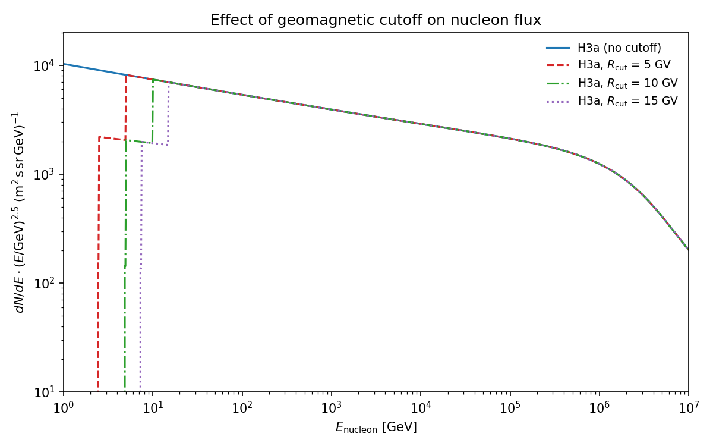

# Available Models

All models inherit from `PrimaryFlux` and implement the same interface.
They accept an optional `geomagnetic_cutoff` parameter (in GV) that zeros
the flux below the corresponding rigidity for each nucleus.

## Model Comparison

### Nucleon Flux

All-nucleon flux (proton + neutron) scaled by $E^{2.5}$ for visibility across the full energy range.



### All-Particle Flux

Total flux of all nuclei (all-particle spectrum) scaled by $E^{2.5}$.



### Neutron Fraction

Fraction of neutrons in the nucleon flux, showing composition differences between models.



### Mean Logarithmic Mass

$\langle\ln A\rangle$ as a function of energy per particle. Higher values indicate heavier composition.



## Parameterized Models

| Class | Reference | Energy Range | Notes |
|-------|-----------|-------------|-------|
| `HillasGaisser2012` | Gaisser, Astropart. Phys. 35, 801 (2012) | Full range | Variants: `H3a`, `H4a` |
| `H3a_polygonato` | Modified Gaisser (2012) | Full range | Poly-gonato at low E |
| `GaisserStanevTilav` | Gaisser, Stanev, Tilav, arXiv:1303.3565 (2013) | Full range | Variants: `3-gen`, `4-gen` |
| `CombinedGHandHG` | Fedynitch et al., PRD 86, 114024 (2012) | Full range | GH at low E, HG at high E |
| `PolyGonato` | Hoerandel, Astropart. Phys. 19, 193 (2003) | Full range | 11 mass groups |
| `ZatsepinSokolskaya` | Zatsepin & Sokolskaya, A&A 458, 1 (2006) | < 1-10 PeV | Variants: `default`, `pamela` |
| `GaisserHonda` | Gaisser & Honda, ARNPS 52, 153 (2002) | < 100 TeV | Tuned to balloon data |
| `Thunman` | Thunman et al., Astropart. Phys. 5, 309 (1996) | Full range | Proton-only broken power law |
| `SimplePowerlaw27` | Based on Thunman | Below knee | Proton-only $E^{-2.7}$ |
| `GlobalSplineFitBeta` | Dembinski et al., PoS ICRC2017 533 | 10 GV - $10^{11}$ GeV | Spline-based, nucleon flux only |

## Nucleus ID Scheme (CORSIKA)

Protons have ID 14. Composite nuclei: `ID = 100 * A + Z`

| Nucleus | A | Z | CORSIKA ID |
|---------|---|---|-----------|
| Proton | 1 | 1 | 14 |
| Helium | 4 | 2 | 402 |
| Carbon | 12 | 6 | 1206 |
| Silicon | 28 | 14 | 2814 |
| Iron | 56 | 26 | 5426 |

## Geomagnetic Cutoff

All models accept `geomagnetic_cutoff` (in GV) as a constructor parameter.
For a nucleus with charge $Z$, the energy cutoff is $E_\text{cut} = Z \times R_\text{cut}$ (GeV).
Flux is zeroed below this energy.

```python
import crflux.models as mods

# 7 GV cutoff (typical for mid-latitudes)
model = mods.HillasGaisser2012("H3a", geomagnetic_cutoff=7.0)
```

The plot below shows the effect of different cutoff values on the H3a nucleon flux:


